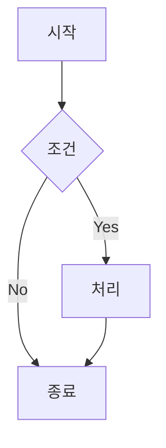

# GitHub Markdown 가이드

GitHub에서 자주 사용되는 Markdown 요소들을 정리한 참조 가이드입니다.

## 목차

1. [제목 (Headings)](#1-제목-headings)
2. [텍스트 강조](#2-텍스트-강조)
3. [목록 (Lists)](#3-목록-lists)
4. [링크 & 이미지](#4-링크--이미지)
5. [코드 (Code)](#5-코드-code)
6. [표 (Tables)](#6-표-tables)
7. [인용 (Blockquote)](#7-인용-blockquote)
8. [구분선 (Horizontal Rule)](#8-구분선-horizontal-rule)
9. [접기/펼치기 (Details)](#9-접기펼치기-details)
10. [각주 (Footnotes)](#10-각주-footnotes)
11. [GitHub 특화 요소](#11-github-특화-요소)
12. [Mermaid 다이어그램](#12-mermaid-다이어그램)
13. [알림 (Alerts)](#13-알림-alerts)

---

## 1. 제목 (Headings)

`#` 기호의 개수로 제목 수준(H1~H6)을 지정합니다.

```markdown
# H1 제목
## H2 제목
### H3 제목
#### H4 제목
##### H5 제목
###### H6 제목
```

> [!TIP]
> `#` 뒤에 반드시 공백 한 칸을 넣어야 제목으로 인식됩니다.

---

## 2. 텍스트 강조

| 효과           | 문법                        | 결과                       |
|----------------|-----------------------------|----------------------------|
| 굵게           | `**텍스트**` 또는 `__텍스트__` | **텍스트**                 |
| 기울임         | `*텍스트*` 또는 `_텍스트_`   | *텍스트*                   |
| 굵게 + 기울임  | `***텍스트***`              | ***텍스트***               |
| 취소선         | `~~텍스트~~`                | ~~텍스트~~                 |
| 인라인 코드    | `` `코드` ``                | `코드`                     |
| 밑줄 (HTML)    | `<u>텍스트</u>`             | <u>텍스트</u>              |

```markdown
**굵게** 또는 __굵게__
*기울임* 또는 _기울임_
***굵게 기울임***
~~취소선~~
`인라인 코드`
<u>밑줄</u>
```

---

## 3. 목록 (Lists)

### 순서 없는 목록 (Unordered List)

`-`, `*`, `+` 중 하나로 시작합니다.

```markdown
- 항목 1
- 항목 2
  - 중첩 항목 2-1
  - 중첩 항목 2-2
- 항목 3
```

### 순서 있는 목록 (Ordered List)

```markdown
1. 첫 번째
2. 두 번째
3. 세 번째
```

### 작업 목록 (Task List)

Issue, PR, 댓글 등에서 체크박스로 렌더링됩니다.

```markdown
- [x] 완료된 항목
- [ ] 미완료 항목
- [ ] 또 다른 미완료 항목
```

---

## 4. 링크 & 이미지

### 링크

```markdown
[표시 텍스트](https://example.com)
[표시 텍스트](https://example.com "툴팁 텍스트")

<!-- 참조 링크 -->
[표시 텍스트][ref]
[ref]: https://example.com
```

### 이미지

```markdown


<!-- 클릭 시 링크로 이동하는 이미지 -->
[](이동할_URL)
```

---

## 5. 코드 (Code)

### 인라인 코드

```markdown
`코드 한 줄`
```

### 코드 블록 (Fenced Code Block)

백틱 세 개(` ``` `) 뒤에 언어 이름을 붙이면 **문법 강조(Syntax Highlighting)** 가 적용됩니다.

````markdown
```javascript
const greet = (name) => `Hello, ${name}!`;
console.log(greet("World"));
```

```python
def greet(name: str) -> str:
    return f"Hello, {name}!"
```

```bash
echo "Hello, World!"
```
````

> [!TIP]
> 지원 언어: `javascript`, `typescript`, `python`, `java`, `go`, `rust`, `bash`, `sql`, `json`, `yaml`, `markdown` 등 수백 가지.

---

## 6. 표 (Tables)

`|`로 열을 구분하고, 두 번째 행에 `-`로 헤더와 본문을 분리합니다.

```markdown
| 열 1  | 열 2  | 열 3  |
|-------|-------|-------|
| A     | B     | C     |
| D     | E     | F     |
```

### 정렬

```markdown
| 왼쪽 정렬 | 가운데 정렬 | 오른쪽 정렬 |
|:---------|:-----------:|-----------:|
| 텍스트    | 텍스트      | 텍스트      |
```

---

## 7. 인용 (Blockquote)

`>` 를 앞에 붙여 인용 블록을 만듭니다.

```markdown
> 단순 인용문입니다.

> 여러 줄 인용도 가능합니다.
> 두 번째 줄입니다.

> 중첩 인용:
> > 안쪽 인용입니다.
```

---

## 8. 구분선 (Horizontal Rule)

`---`, `***`, `___` 중 하나로 수평선을 삽입합니다.

```markdown
---
***
___
```

> [!NOTE]
> `---` 앞뒤로 빈 줄을 두지 않으면 위 줄이 H2 제목으로 해석될 수 있으니 주의하세요.

---

## 9. 접기/펼치기 (Details)

HTML `<details>` 태그를 이용해 내용을 접을 수 있습니다.

```markdown
<details>
<summary>클릭해서 펼치기</summary>

여기에 숨길 내용을 작성합니다.

- 목록도 가능
- 코드 블록도 가능

</details>
```

<details>
<summary>예시 — 클릭해서 펼치기</summary>

이 안의 내용은 기본적으로 숨겨져 있습니다.

```python
print("숨겨진 코드 예시")
```

</details>

---

## 10. 각주 (Footnotes)

```markdown
본문에 각주를 달 수 있습니다.[^1]

[^1]: 각주 내용은 문서 하단에 렌더링됩니다.
```

---

## 11. GitHub 특화 요소

### 사용자/팀 멘션

```markdown
@username          <!-- 특정 사용자 멘션 -->
@org/team-name     <!-- 특정 팀 멘션 -->
```

### Issue · PR 참조

```markdown
#123               <!-- 같은 저장소의 이슈/PR -->
owner/repo#123     <!-- 다른 저장소 -->
```

### 커밋 참조

```markdown
a1b2c3d            <!-- 커밋 SHA (7자 이상) -->
```

### 키보드 단축키 표시

```markdown
<kbd>Ctrl</kbd> + <kbd>C</kbd>
```

렌더링 결과: <kbd>Ctrl</kbd> + <kbd>C</kbd>

### 이모지

```markdown
:smile:  :rocket:  :white_check_mark:  :warning:
```

[GitHub 이모지 전체 목록](https://github.com/ikatyang/emoji-cheat-sheet)

---

## 12. Mermaid 다이어그램

GitHub는 코드 블록 언어를 `mermaid`로 지정하면 다이어그램을 렌더링합니다.

````markdown

````


**지원하는 다이어그램 종류**

| 종류              | 키워드          |
|-------------------|-----------------|
| 흐름도            | `flowchart`     |
| 시퀀스 다이어그램 | `sequenceDiagram` |
| 클래스 다이어그램 | `classDiagram`  |
| 간트 차트         | `gantt`         |
| ER 다이어그램     | `erDiagram`     |
| 원형 차트         | `pie`           |

---

## 13. 알림 (Alerts)

GitHub의 Markdown에서는 독자의 주의를 끌기 위한 **5가지 알림(Alert) 요소**를 지원합니다.  
`>` 블록 인용 문법에 `[!TYPE]` 키워드를 조합하여 사용합니다.

---

## 기본 문법

```markdown
> [!TYPE]
> 내용을 여기에 작성합니다.
```

---

## 알림 유형별 사용법

### 1. NOTE

> [!NOTE]
> 독자가 알아두면 유용한 **추가 정보**를 제공할 때 사용합니다.

```markdown
> [!NOTE]
> 독자가 알아두면 유용한 추가 정보를 제공할 때 사용합니다.
```

---

### 2. TIP

> [!TIP]
> 더 나은 방법이나 **유용한 팁**을 안내할 때 사용합니다.

```markdown
> [!TIP]
> 더 나은 방법이나 유용한 팁을 안내할 때 사용합니다.
```

---

### 3. IMPORTANT

> [!IMPORTANT]
> 목표를 달성하는 데 **필수적인 정보**를 강조할 때 사용합니다.

```markdown
> [!IMPORTANT]
> 목표를 달성하는 데 필수적인 정보를 강조할 때 사용합니다.
```

---

### 4. WARNING

> [!WARNING]
> 잠재적인 **위험 또는 문제**에 대해 주의를 요구할 때 사용합니다.

```markdown
> [!WARNING]
> 잠재적인 위험 또는 문제에 대해 주의를 요구할 때 사용합니다.
```

---

### 5. CAUTION

> [!CAUTION]
> 특정 행동으로 인해 발생할 수 있는 **부정적인 결과**를 경고할 때 사용합니다.

```markdown
> [!CAUTION]
> 특정 행동으로 인해 발생할 수 있는 부정적인 결과를 경고할 때 사용합니다.
```

---

## 유형 비교 요약

| 유형          | 색상(GitHub) | 사용 목적                                      |
|---------------|-------------|------------------------------------------------|
| `[!NOTE]`     | 파란색       | 추가 정보, 참고 사항 전달                        |
| `[!TIP]`      | 초록색       | 유용한 팁, 권장 방법 안내                        |
| `[!IMPORTANT]`| 보라색       | 놓치면 안 되는 중요 정보 강조                    |
| `[!WARNING]`  | 주황색       | 주의가 필요한 잠재적 위험 경고                   |
| `[!CAUTION]`  | 빨간색       | 부정적 결과를 초래할 수 있는 행동 경고           |

---

## 여러 줄 작성

알림 블록 내에 여러 줄을 작성할 수 있습니다.

```markdown
> [!NOTE]
> 첫 번째 줄입니다.
> 두 번째 줄입니다.
> 세 번째 줄입니다.
```

---

## 지원 환경

GitHub Markdown alerts는 다음 환경에서 렌더링됩니다.

- GitHub.com (Issues, Pull Requests, Discussions, README 등)
- GitHub Docs

> [!WARNING]
> 일반 Markdown 렌더러(예: VS Code 기본 미리보기, 일부 외부 도구)에서는 지원되지 않을 수 있습니다.

---

## 참고 링크

- [GitHub Docs — Basic writing and formatting syntax](https://docs.github.com/en/get-started/writing-on-github/getting-started-with-writing-and-formatting-on-github/basic-writing-and-formatting-syntax)
- [GitHub Docs — Alerts](https://docs.github.com/en/get-started/writing-on-github/getting-started-with-writing-and-formatting-on-github/basic-writing-and-formatting-syntax#alerts)
- [GitHub Docs — Organizing information with tables](https://docs.github.com/en/get-started/writing-on-github/working-with-advanced-formatting/organizing-information-with-tables)
- [GitHub Docs — Creating diagrams (Mermaid)](https://docs.github.com/en/get-started/writing-on-github/working-with-advanced-formatting/creating-diagrams)
- [GitHub 이모지 치트시트](https://github.com/ikatyang/emoji-cheat-sheet)
